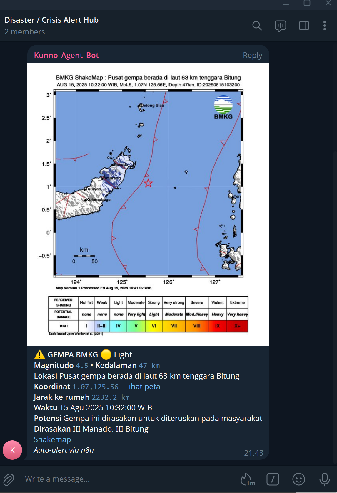
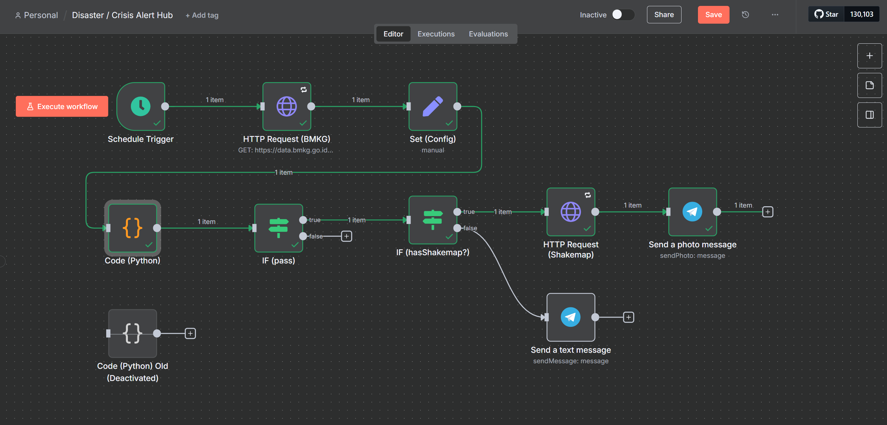

<div align="center">

# 🌋 n8n Disaster / Crisis Alert Hub
**Realtime gempa dari BMKG → Telegram** dengan **n8n** (Docker).  
Format rapi (HTML), auto-filter, dan kirim **Shakemap** sebagai foto.

[](https://n8n.io)    [](#-lisensi)

</div>

> **Catatan**: Proyek portofolio, **tidak resmi** dari BMKG. Gunakan sumber resmi untuk keputusan kritis.

---
<p align="center">
  
</p>

## 🎯 Tujuan & Manfaat

<i> **n8n Disaster / Crisis Alert Hub** </i> adalah workflow siap pakai untuk mengirim peringatan gempa BMKG ke Telegram secara otomatis, relevan (sesuai lokasi & ambang magnitudo), dan tanpa spam (ada dedup jendela waktu). Fokusnya: memberi informasi yang bisa langsung ditindaklanjuti, bukan sekadar notifikasi ramai.

#### Kenapa dibuat?

- **Kebisingan informasi** : feed peringatan sering ramai, sulit membedakan mana yang relevan buat kita.
- **Respons cepat menyelamatkan waktu (dan potensi risiko)** : info yang tepat, sampai ke orang yang tepat, lebih cepat.
- **Open-source & bisa di-hosting sendiri** : tidak bergantung layanan pihak ketiga; mudah diaudit dan dikembangkan.
- **Portabilitas** : berbasis Docker + n8n → bisa jalan di laptop, mini-PC, VPS, sampai Kubernetes.

#### Siapa yang terbantu?

- **Individu & keluarga** yang ingin notifikasi gempa di sekitar rumah/kantor.
- **Tim fasilitas/HSSE** di perusahaan, kampus, dan gedung publik yang perlu pemantauan cepat.
- **Relawan/komunitas/NGO kebencanaan** untuk koordinasi di grup Telegram.
- **Developer/DevOps** yang butuh fondasi workflow siap-extend (multi-channel, multi-sumber).

---

## ⚡ TL;DR
```bash
git clone https://github.com/ilfijandrisno/n8n-disaster-crisis-alert-hub.git
cd n8n-disaster-crisis-alert-hub
cp .env.example .env   # edit nilai-nilai penting
docker compose up -d   # jalankan n8n
# Buka http://localhost:5678 → import workflow JSON → isi Set(Config) → Activate
```

---

## ✨ Fitur
- ⏱️ **Scheduler** (default 5 menit) – tarik data `autogempa.json` BMKG
- 📍 **Geofencing** – hitung jarak rumah (Haversine) & batasi radius
- 📈 **Ambang magnitudo** – kirim hanya jika ≥ `MIN_MAGNITUDE`
- 🧠 **Dedup tanpa DB** – hanya event baru (≤ `MAX_EVENT_AGE_MINUTES`)
- 🗺️ **HTML yang enak dibaca** + tautan Google Maps
- 🖼️ **Shakemap sebagai foto** – diunduh dulu lalu dikirim **binary**
- 🛟 **Fallback** – jika Shakemap tak ada, kirim **teks** saja
- 🔧 **Mudah diatur** – semua parameter di **Set (Config)**

---

## 🧩 Cara Kerja (sekilas)
```
Schedule → HTTP(BMKG) → Set(Config) → Code(Python) → IF pass?
                                                      └─ true → IF hasShakemap?
                                                                   ├─ true  → HTTP (Shakemap, download→binary 'shakemap')
                                                                   │                        └─ → Telegram: Send Photo (caption = HTML)
                                                                   └─ false → Telegram: Send Message (HTML)
```

> **Code (Python)** mem-parse data BMKG, menghitung jarak & filter, lalu membentuk teks HTML siap kirim.

---

## 🗂️ Struktur Repo
```
.
├─ README.md
├─ docker-compose.yml
├─ .env.example
├─ workflows/
│  └─ DisasterCrisisAlertHub.json       # export workflow dari n8n
├─ code/
│  └─ quake_alert.py
├─ docs/
│  ├─ flow.png
│  └─ telegram-setup.md                 # panduan token/chat_id
├─ images/
│  ├─ workflow.png
└─ LICENSE
```

---

## 🚀 Quick Start (lengkap)
1. **Jalankan n8n (Docker)**
   ```bash
   cp .env.example .env
   docker compose up -d
   ```
   Buka `http://localhost:5678` → buat akun admin.

2. **Import workflow**  
   `Workflows → Import from file` → pilih `workflows/DisasterCrisisAlertHub.json`.

3. **Buat Credentials Telegram**  
   `Credentials → New → Telegram` → paste **bot token** dari **@BotFather** → Save.

4. **Isi Set (Config)** (tipe data penting!)

   | Key | Tipe | Contoh | Keterangan |
   |---|---|---|---|
   | `HOME_LAT` | Number | `-6.2` | Latitude rumah |
   | `HOME_LON` | Number | `106.8` | Longitude rumah |
   | `MAX_DISTANCE_KM` | Number | `500` | Radius maksimum |
   | `MIN_MAGNITUDE` | Number | `4.5` | Ambang magnitudo |
   | `MAX_EVENT_AGE_MINUTES` | Number | `6` | Window “baru” (anti-duplikat) |
   | `TELEGRAM_CHAT_ID` | String | `-1001234567890` | ID grup/channel (negatif untuk grup) |

   > **Tips aman:** isi sebagai **Expression** dari env → `{{$env.TELEGRAM_CHAT_ID}}`.

5. **Konfigurasi node** (cek cepat)
   - **HTTP (BMKG)**: `GET https://data.bmkg.go.id/DataMKG/TEWS/autogempa.json`
   - **Code (Python)**: tempel skrip dari `code/quake_alert.py`
   - **HTTP (Shakemap)**: URL `{{$json.shakemapUrl}}` → **Response=File**, **Binary property=shakemap**
   - **Telegram Send Photo**: Binary=ON, Property=`shakemap`, Caption=`{{$json.text}}`, Parse Mode=HTML
   - **Telegram Send Message**: Text=`{{$json.text}}`, Parse Mode=HTML

6. **Uji coba**
   - Sementara set: `MAX_DISTANCE_KM=10000`, `MIN_MAGNITUDE=0`, `MAX_EVENT_AGE_MINUTES=600`  
   - **Execute workflow** → pastikan masuk ke Telegram.  
   - Kembalikan nilai ke normal setelahnya.

7. **Activate** workflow agar scheduler berjalan otomatis.

---

## 👀 Preview

<p align="center">
  
</p>

<p align="center">
  <i>Workflow ringkas: Schedule → BMKG → Filter Python → Kirim Shakemap ke Telegram</i>
</p>

---

## ⚙️ Environment
**`.env.example`**
```dotenv
# Sistem
TZ=Asia/Jakarta
N8N_HOST=localhost
N8N_PORT=5678
N8N_PROTOCOL=http

# Telegram (contoh; jangan commit nilai asli ke publik)
TELEGRAM_CHAT_ID=-1001234567890

# Parameter default (opsional, bisa direfer dengan $env)
HOME_LAT=-6.2
HOME_LON=106.8
MAX_DISTANCE_KM=500
MIN_MAGNITUDE=4.5
MAX_EVENT_AGE_MINUTES=6
```

**`docker-compose.yml`**
```yaml
version: "3.8"

services:
  n8n:
    image: n8nio/n8n:1.106.3
    container_name: n8n_alert_hub
    ports:
      - "${N8N_PORT:-5678}:5678"
    environment:
      - TZ=${TZ:-Asia/Jakarta}
      - GENERIC_TIMEZONE=${TZ:-Asia/Jakarta}
      - N8N_HOST=${N8N_HOST:-localhost}
      - N8N_PORT=${N8N_PORT:-5678}
      - N8N_PROTOCOL=${N8N_PROTOCOL:-http}
      - WEBHOOK_URL=${N8N_PROTOCOL:-http}://${N8N_HOST:-localhost}:${N8N_PORT:-5678}/
      - NODE_FUNCTION_ALLOW_BUILTIN=*
      - NODE_FUNCTION_ALLOW_EXTERNAL=*
    volumes:
      - n8n_data:/home/node/.n8n
    restart: unless-stopped

volumes:
  n8n_data:
```

---

## 🧪 Troubleshooting cepat
- **`Bad Request: chat_id is empty`** → Chat ID kosong/salah. Untuk grup harus `-100…` (angka negatif).  
- **HTML tampil sebagai teks** → Pastikan **Parse Mode = HTML** di kedua node Telegram.  
- **`wrong type of the web page content` saat Send Photo** → Unduh Shakemap dulu (node HTTP → **binary**) baru kirim.  
- **Schedule tak berjalan** → Workflow harus **Activated** (bukan sekadar dieksekusi manual).  
- **Zona waktu salah** → Set `TZ` & `GENERIC_TIMEZONE` ke `Asia/Jakarta` pada container.

---

## 🛣️ Roadmap singkat
- [ ] Multi-channel (Email/Slack/Twilio)
- [ ] Sumber ganda (USGS/EMSC) + merging
- [ ] Data Store/DB untuk dedup persisten
- [ ] Dashboard rekap (Google Sheets / Supabase)

---

## 🙌 Kredit
- Data gempa: **BMKG** – `autogempa.json`
- Workflow engine: **n8n**

---

## 📜 Lisensi
Proyek ini berlisensi **MIT** – lihat file [`LICENSE`](LICENSE) untuk detail.
